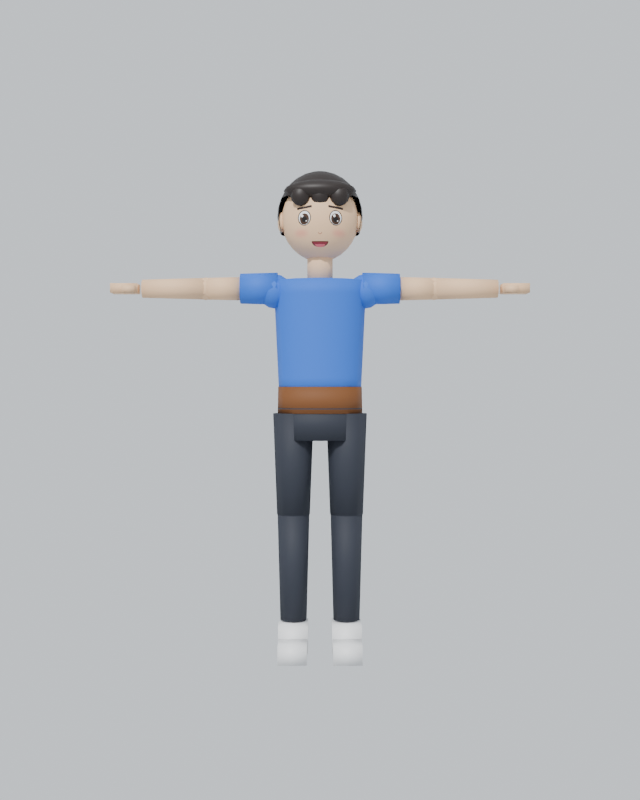

# Mixamo Character Demo (Godot 4.3)

ตัวละคร 3D สร้างด้วย **Blender** ใช้โครงกระดูกแบบ **Mixamo** และใช้ท่าทางจาก
[Godot4-OpenAnimationLibraries](https://github.com/catprisbrey/Godot4-OpenAnimationLibraries)
(`MeleeLib.res` + `ShooterLib.res`) ผ่าน `Mixamo BoneMap.tres`

**▶ เล่นบนเว็บ:** `https://<username>.github.io/<repo>/`



## ขั้นตอนการทำงาน
1. **Blender**: ปั้นตัวละคร low-poly ในท่า T-pose ใส่ใบหน้าจากรูป (`blender/face.png`) และสร้างโครงกระดูกชื่อแบบ Mixamo แล้ว export เป็น `character/character.glb`
2. **Godot Import**: เปิด Advanced Import เลือก `Skeleton3D` แล้วตั้ง Retarget → Bone Map = `animations/mixamo_bonemap.tres`
3. **Animation Library**: ใน `scripts/dancer.gd` ใส่ `MeleeLib` และ `ShooterLib` ให้กับ `AnimationPlayer`
4. **Scene Demo** (`scenes/main.tscn`): มีตัวละคร 7 ตัว แต่ละตัวเล่นท่าต่างกัน
   - หากต้องการเปลี่ยนท่า ให้คลิกที่ `DancerX` แล้วแก้ค่า `animation_name` ใน Inspector เช่น `MeleeLib/Slash1` หรือ `ShooterLib/kick1`

## โครงสร้างไฟล์
```
character/character.glb   โมเดลจาก Blender
animations/               BoneMap + MeleeLib + ShooterLib
scenes/dancer.tscn        ตัวละคร 1 ตัว (ใช้ dancer.gd)
scenes/main.tscn          ฉากเกาะ + ต้นไม้ + ตัวละคร 7 ตัว
scripts/dancer.gd         สคริปต์เล่นท่า (ประมาณ 10 บรรทัด)
blender/                  ไฟล์ .blend + รูปใบหน้า
docs/                     Web export สำหรับ GitHub Pages
```

## Export Web
Project → Export → Web (ปิด Thread Support) → Export Path `docs/index.html`
แล้วไปที่ GitHub → Settings → Pages → Branch `main` / โฟลเดอร์ `/docs`

## Credits
- Animations & BoneMap: catprisbrey / Godot4-OpenAnimationLibraries (Mixamo-based)
